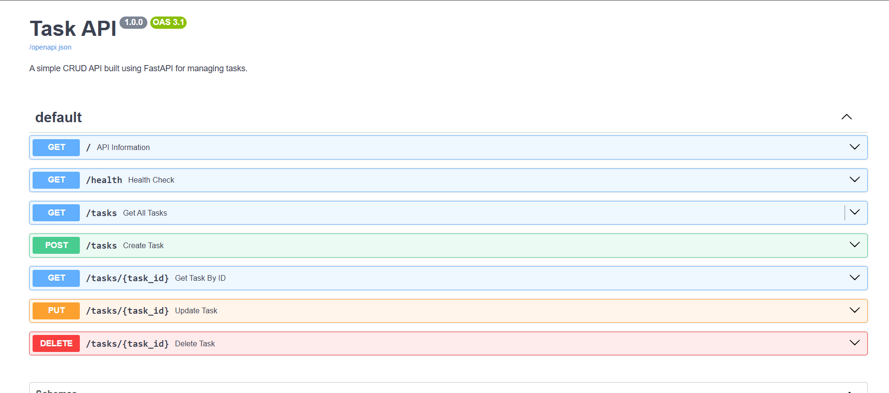

# FlyRank Backend Internship – Week 2 Assignment

## Build Your First CRUD API

This project is a simple REST API built using **FastAPI**.

It demonstrates CRUD (Create, Read, Update and Delete) operations on an in-memory task list.

The project was developed as part of the **FlyRank Backend Development Internship – Week 2 Assignment**.

---

## Tech Stack

- Python 3
- FastAPI
- Pydantic
- Uvicorn

---

## Installation

Clone the repository

```bash
git clone <repository-url>
```

Move into the project directory

```bash
cd week2
```

Install dependencies

```bash
pip install -r requirements.txt
```

---

## Run

Start the API server

```bash
uvicorn main:app --reload
```

Open the API:

```
http://127.0.0.1:8000
```

Swagger UI:

```
http://127.0.0.1:8000/docs
```

---

# API Endpoints

| Method | Endpoint | Description |
|----------|-----------------|--------------------------|
| GET | `/` | API Information |
| GET | `/health` | Health Check |
| GET | `/tasks` | Get all tasks |
| GET | `/tasks/{task_id}` | Get task by ID |
| POST | `/tasks` | Create a task |
| PUT | `/tasks/{task_id}` | Update a task |
| DELETE | `/tasks/{task_id}` | Delete a task |

---

# Example curl Output

```bash
curl -i http://127.0.0.1:8000/tasks
```

Example Output

```http
HTTP/1.1 200 OK
date: Tue, 15 Jul 2026 10:30:00 GMT
server: uvicorn
content-type: application/json
content-length: 180

[
  {
    "id": 1,
    "title": "Learn FastAPI",
    "done": false
  },
  {
    "id": 2,
    "title": "Build CRUD API",
    "done": false
  },
  {
    "id": 3,
    "title": "Submit Assignment",
    "done": true
  }
]
```

---

# Swagger UI

The API documentation is automatically generated by FastAPI.

Open:

```
http://127.0.0.1:8000/docs
```

Screenshot:

```markdown

```

> If your README is in the repository root and the image is inside the **week2** folder, use:

```markdown

```

---

## Project Features

- Create a task
- Read all tasks
- Read a single task
- Update a task
- Delete a task
- Health check endpoint
- Automatic Swagger documentation
- Input validation
- Proper HTTP status codes

---

## HTTP Status Codes

| Code | Meaning |
|------|---------|
| 200 | OK |
| 201 | Created |
| 204 | No Content |
| 400 | Bad Request |
| 404 | Not Found |

---

## Author

**Sarweshwar Goud**

FlyRank Backend Internship – Week 2 Assignment